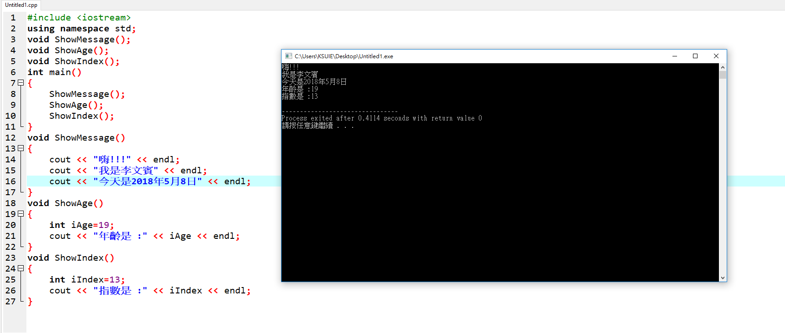

```
#include <iostream>
using namespace std;
void ShowMessage(); 
void ShowAge(); 
void ShowIndex(); 
int main()
{
	ShowMessage(); 
	ShowAge(); 
	ShowIndex(); 
	return 0;
}
void ShowMessage()
{
	cout << "嗨!!!" << endl;
	cout << "我是李文賓" << endl;
	cout << "今天是2018年5月8日" << endl;
}
void ShowAge()
{
	int iAge=19;
	cout << "年齡是 :" << iAge << endl;
}
void ShowIndex()
{
	int iIndex=13;
	cout << "指數是 :" << iIndex << endl;
}
```

