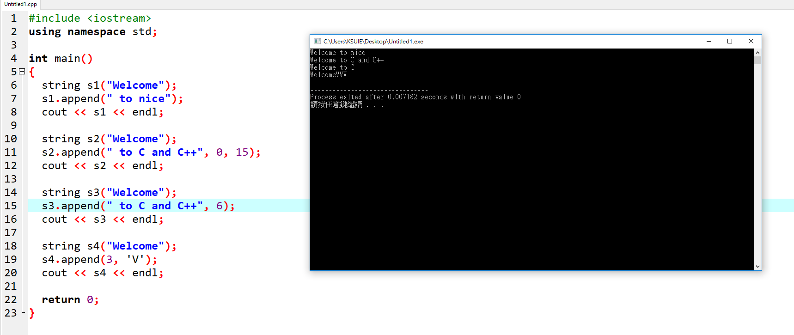

```
#include <iostream>
using namespace std;

int main()
{
  string s1("Welcome");
  s1.append(" to nice"); 
  cout << s1 << endl; 
  
  string s2("Welcome");
  s2.append(" to C and C++", 0, 15); 
  cout << s2 << endl; 

  string s3("Welcome");
  s3.append(" to C and C++", 6); 
  cout << s3 << endl; 

  string s4("Welcome"); 
  s4.append(3, 'V'); 
  cout << s4 << endl;

  return 0;
}
```

