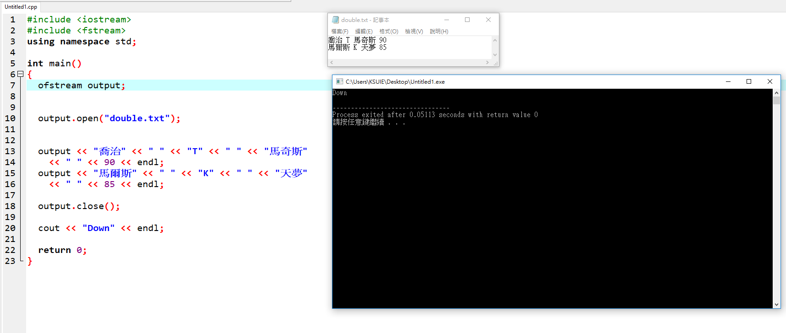

```
#include <iostream>
#include <fstream>
using namespace std;

int main()
{
  ofstream output;


  output.open("double.txt");


  output << "喬治" << " " << "T" << " " << "馬奇斯" 
    << " " << 90 << endl;
  output << "馬爾斯" << " " << "K" << " " << "天夢" 
    << " " << 85 << endl;

  output.close();

  cout << "Down" << endl;

  return 0;
}
```

