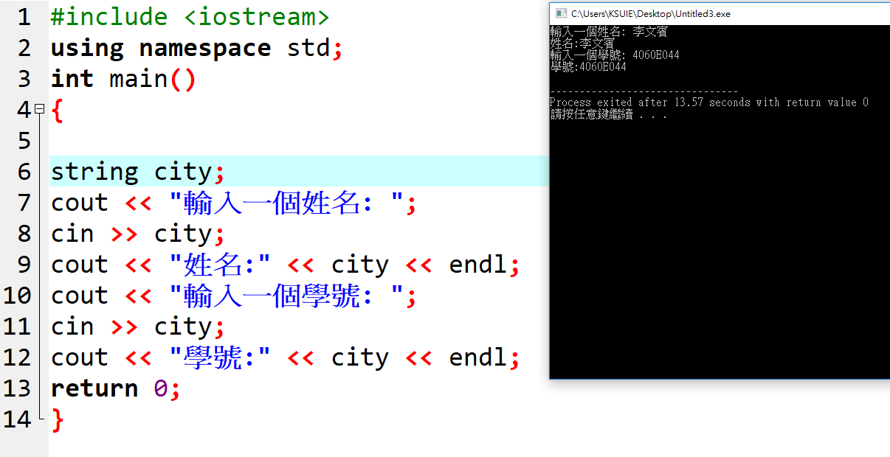

---
#include <iostream>
using namespace std;
int main()
{

string city;
cout << "輸入一個姓名: ";
cin >> city; 
cout << "姓名:" << city << endl;
cout << "輸入一個學號: ";
cin >> city; 
cout << "學號:" << city << endl;
return 0;
}
---

